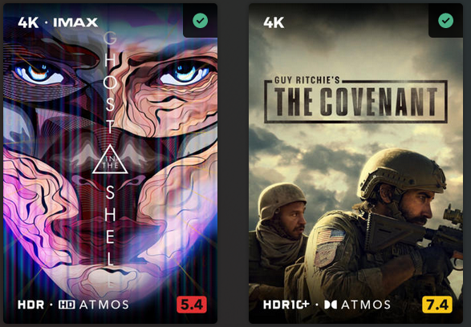

{ align=right itemprop="image" }

**Welcome to the first of (hopefully many) showcases of our fantastic community-driven creations**

This week, we wanted to highlight the incredible work of [jmxd](https://github.com/jmxd/Kometa), who has been creating some stunning overlays for Kometa users to enjoy.

jmxd has been a member of the [Kometa Discord Server](https://kometa.wiki/en/latest/discord/) for some time now, and after some time developing it, has finally released his take on Overlays based on Media Info (resolution, edition) and Audience Rating Overlays.

Click continue reading to find out more about what jmx has been working on!

<!-- more -->

## jmxd Overlays

jmxd has created two modular Overlay files which can be used independently or (as we would recommend) together.

The first overlay shows the current audience rating value which is set in your Plex server. Ratings are on a colour scale, with the colour changing depending on the rating value (green for 8+, yellow for 6-7, and red for <6). The overlay also includes the resolution and edition of the media.

The second overlay shows media info characteristics such as resolutions, editions, video and audio formats. They are minimalistic, streamlined and pleasing on the eye.

Here are some examples of jmxd's overlays in action:


### Important Notes

The full documentation for these Overlays is available at [jmxd's GitHub repository](https://github.com/jmxd/Kometa).

These overlays are designed to be used alongside the [TRaSH Naming Conventions](https://trash-guides.info/Radarr/Radarr-recommended-naming-scheme/#plex), which is a popular file naming convention used by many Plex users.

These Overlays are designed specifically for "high quality" media, so any resolution below 1080p will not show a resolution overlay.

Dolby Vision with HDR/HDR10+ fallback support is correctly detected and matched separately from exclusive DV, but only Dolby Vision will be visibly shown for those files. See examples at the bottom for an alternative option.

These overlays work at the Movie, Show and Episode levels.

## Usage

To use these overlays, visit the [jxmd GitHub repository](https://github.com/jmxd/Kometa). Then click the green "Code" button and select "Download ZIP". Extract the contents of the ZIP file and place the contents in the folder that you have mapped to `config` within Kometa.

Once the above is done, to use the Overlays as they are intended, you will need to add the following to your `config.yml` file (replacing `LIBRARYNAMEHERE` with your Library Name):

```yaml
libraries:
  LIBRARYNAMEHERE:
    overlay_files:
      - file: config/overlays/media_info.yml
      - file: config/overlays/audience_rating.yml
```

There are a number of variables (such as enabling/disabling specific aspects of the overlays) that can be amended using template variables. Those can be found in the [GitHub repository](https://github.com/jmxd/Kometa).

There is also a dedicated [Discord Thread](https://discord.com/channels/822460010649878528/1248134055527059496) for jxmd's creation, any thanks and support can be asked within that thread.

We'd like to thank jxmd for his hard work on these Overlays, and we look forward to sharing more community creations in the future! 
